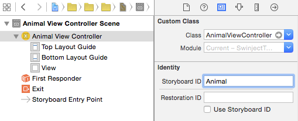
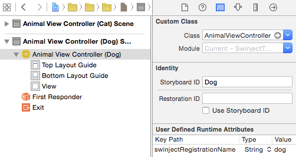

# Storyboard

Swinject supports automatic dependency injection to view controllers instantiated by `SwinjectStoryboard`. This class inherits `UIStoryboard` (or `NSStoryboard` in case of OS X). To register dependencies of a view controller, use `registerForStoryboard` method. In the same way as a registration of a service type, a view controller can be registered with or without a name.

**NOTE**: Do NOT explicitly resolve the view controllers registered by `registerForStoryboard` method. The view controllers are intended to be resolved by `SwinjectStoryboard` implicitly.

## Registration

### Registration without Name

Here is a simple example to register a dependency of a view controller without a registration name:

```swift
let container = Container()
container.registerForStoryboard(AnimalViewController.self) { r, c in
    c.animal = r.resolve(AnimalType.self)
}
container.register(AnimalType.self) { _ in Cat(name: "Mimi") }
```

Next, we create an instance of `SwinjectStoryboard` with the container specified. If the container is not specified, `SwinjectStoryboard.defaultContainer` is used instead. `instantiateViewControllerWithIdentifier` method creates an instance of the view controller with its dependencies injected:

```swift
let sb = SwinjectStoryboard.create(
    name: "Animals", bundle: nil, container: container)
let controller = sb.instantiateViewControllerWithIdentifier("Animal")
    as! AnimalViewController
print(controller.animal! is Cat) // prints "true"
print(controller.animal!.name) // prints "Mimi"
```

Where the classes and protocol are:

```swift
class AnimalViewController: UIViewController {
    var animal: AnimalType?

    required init?(coder aDecoder: NSCoder) {
        super.init(coder: aDecoder)
    }
}

protocol AnimalType {
    var name: String { get set }
}

class Cat: AnimalType {
    var name: String

    init(name: String) {
        self.name = name
    }
}
```

and the storyboard named `Animals.storyboard` has `AnimalViewController` with storyboard ID `Animal`.



### Registration with Name

If a storyboard has more than one view controller with the same type, dependencies should be registered with registration names.

```swift
let container = Container()
container.registerForStoryboard(AnimalViewController.self, name: "cat") {
    r, c in c.animal = r.resolve(AnimalType.self, name: "mimi")
}
container.registerForStoryboard(AnimalViewController.self, name: "dog") {
    r, c in c.animal = r.resolve(AnimalType.self, name: "hachi")
}
container.register(AnimalType.self, name: "mimi") {
    _ in Cat(name: "Mimi")
}
container.register(AnimalType.self, name: "hachi") {
    _ in Dog(name: "Hachi")
}
```

Then view controllers are instantiated with storyboard IDs similarly to the case without registration names:

```swift
let sb = SwinjectStoryboard.create(
    name: "Animals", bundle: nil, container: container)
let catController = sb.instantiateViewControllerWithIdentifier("Cat")
    as! AnimalViewController
let dogController = sb.instantiateViewControllerWithIdentifier("Dog")
    as! AnimalViewController
print(catController.animal!.name) // prints "Mimi"
print(dogController.animal!.name) // prints "Hachi"
```

Where `Dog` class is:

```swift
class Dog: AnimalType {
    var name: String

    init(name: String) {
        self.name = name
    }
}
```

and the storyboard named `Animals.storyboard` has `AnimalViewController`s with storyboard IDs `Cat` and `Dog`. In addition to the storyboard IDs, user defined runtime attributes are specified as `cat` and `dog` for the key `swinjectRegistrationName`, respectively.



## UIWindow and Root View Controller Instantiation

### Implicit Instantiation from "Main" Storyboard

If you implicitly instantiate `UIWindow` and its root view controller from "Main" storyboard, implement `setup` class method as an extension of `SwinjectStoryboard` to register dependencies to `defaultContainer`. When the root view controller (initial view controller) is instantiated by runtime, dependencies registered to `defaultContainer` are injected.

```swift
extension SwinjectStoryboard {
    class func setup() {
        defaultContainer.registerForStoryboard(AnimalViewController.self) { r, c in
            c.animal = r.resolve(AnimalType.self)
        }
        defaultContainer.register(AnimalType.self) { _ in Cat(name: "Mimi") }
    }
}
```

### Explicit Instantiation in AppDelegate

If you prefer explicit instantiation of UIWindow and its root view controller, instantiate `SwinjectStoryboard` with a container in `application:didFinishLaunchingWithOptions:` method.

```swift
@UIApplicationMain
class AppDelegate: UIResponder, UIApplicationDelegate {
    var window: UIWindow?
    var container: Container = {
        let container = Container()
        container.registerForStoryboard(AnimalViewController.self) { r, c in
            c.animal = r.resolve(AnimalType.self)
        }
        container.register(AnimalType.self) { _ in Cat(name: "Mimi") }
        return container
    }()

    func application(
        application: UIApplication,
        didFinishLaunchingWithOptions launchOptions: [NSObject: AnyObject]?) -> Bool
    {
        let window = UIWindow(frame: UIScreen.mainScreen().bounds)
        window.makeKeyAndVisible()
        self.window = window

        let storyboard = SwinjectStoryboard.create(name: "Main", bundle: nil, container: container)
        window.rootViewController = storyboard.instantiateInitialViewController()

        return true
    }
}
```

Notice that you should delete the `Main storyboard file base name` item (or `UIMainStoryboardFile` item if you are displaying raw keys/values) in `Info.plist` of your app.

## Storyboard References

Storyboard Reference introduced with Xcode 7 is supported by `SwinjectStoryboard`. To enable dependency injection when an instance is created from a referenced storyboard, register dependencies to `defaultContainer` static property of `SwinjectStoryboard`.

```swift
let container = SwinjectStoryboard.defaultContainer
container.registerForStoryboard(AnimalViewController.self) { r, c in
    c.animal = r.resolve(AnimalType.self)
}
container.register(AnimalType.self) { _ in Cat(name: "Mimi") }
```

If you implicitly instantiate `UIWindow` and its root view controller, the registrations setup for "Main" storyboard can be shared with the referenced storyboard since `defaultContainer` is configured in `setup` method.

_[Table of Contents](README.md)_
